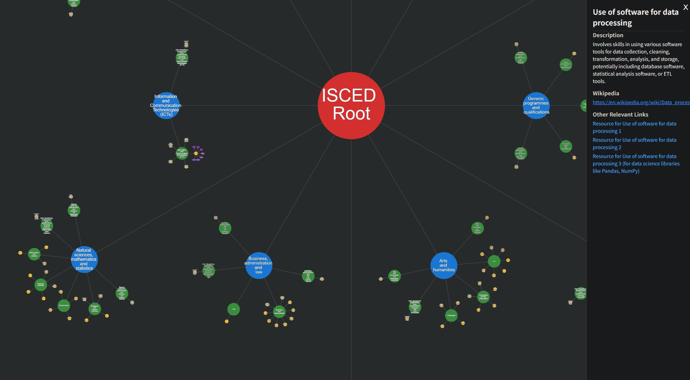

# SkillTree: Visualizing All Human Knowledge Based on ISCED

This project aims to visualize all human occupations and educational fields using the official  
[**ISCED-F 2013** classification](public/international-standard-classification-of-education-fields-of-education-and-training-2013-detailed-field-descriptions-2015-en.pdf)  
from UNESCO (International Standard Classification of Education – Fields of Education and Training).

[中文版README](README_ZH.md)
---

## What is This?

- A **visual skill tree** that shows the global structure of knowledge and occupational domains.
- Based on the ISCED-F hierarchy: from **broad fields (0–10)** to **detailed subfields**.
- Designed to be **community-driven**: detailed nodes are manually contributed by users.
- Built in **TypeScript** (my first time using it!) — most of the code was generated with the help of AI.

---

## Why Community Contribution?

The classification contains **hundreds of small subfields**, and each one may include dozens of tiny subcategories.

For example:

- `0611.json` corresponds to the "Computer use" subfield, which includes:
  - Use of spreadsheets
  - Use of software for data processing
  - Use of software for word processing
  - Use of the Internet
  - And more...

These details **must be filled manually**, with:

- Name of the micro-topic
- Short description
- Reference link (e.g., Wikipedia)
- Optional: learning resources, courses, videos, etc.

---

## How to Contribute?

We welcome any kind of contribution! Especially:

- Filling out JSON files in the `data/en/` or `data/zh/` folders
- Improving TypeScript code or UI logic
- Helping write better documentation

See [CONTRIBUTING.md](./CONTRIBUTING.md) for detailed instructions.

You don't need to be an expert — if you're willing to explore a topic and organize information, your help is already extremely valuable.

---

## Local Development

To run the project locally:

```bash
git clone https://github.com/Samuel-233/SkillTree.git
cd SkillTree
npm install
npm run dev
```

---

## A Note from the Author

This is my **first open-source project**.

- The code is not perfect.
- The structure may be rough.
- I’m new to TypeScript.
- But the idea matters — and I’m committed to improving it over time.

Please don’t hesitate to join, contribute, or give feedback. Every small help counts.

---
